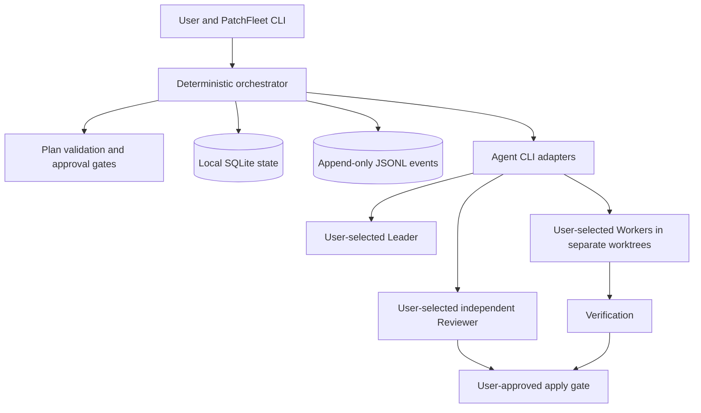

# PatchFleet

PatchFleet is a local-first, human-approved CLI control plane for coordinating existing coding-agent CLIs. You choose the Leader, Workers, and Reviewer, including each provider and model. PatchFleet is intended to turn their work into a visible plan, bounded tasks, independent review, and an explicit decision before changes reach your main branch. It does not replace Codex CLI, Claude Code, or other coding agents.

Launching several agents is easy; keeping their assignments, dependencies, changes, and approvals coherent is harder. PatchFleet addresses that coordination problem while keeping the repository and decisions on your machine.

Phase 0 is a foundation: documentation and an installable CLI with `--help`. It does **not** execute agents or change a repository.

## Core principles

- **The user chooses.** PatchFleet never silently selects or substitutes a provider, model, or role.
- **Plan before execution.** The Leader discusses the request with the user and proposes a structured engineering plan. Validation and user approval precede Worker execution.
- **Bounded work.** Workers receive explicit tasks, path limits, acceptance criteria, test commands, and budgets. Future runs use one Git worktree per Worker.
- **Independent review.** A Reviewer runs separately from the implementer and evaluates the result against the approved plan.
- **Human-controlled integration.** Applying code to the main branch requires a distinct, explicit user approval.
- **Local by default.** State and event logs live locally. No PatchFleet account, cloud service, GitHub Issues, or web dashboard is required.

## Intended architecture



The diagram describes the planned system; only the CLI entry point exists in Phase 0.

## Planned workflow

1. The user states a request and explicitly selects the Leader, Worker(s), and Reviewer with their models.
2. The Leader discusses the request with the user and produces a structured plan.
3. PatchFleet validates the plan's shape, dependencies, assignments, limits, and approval requirements.
4. The user approves the plan before any Worker starts.
5. Workers execute bounded tasks in separate Git worktrees.
6. PatchFleet runs the specified verification commands and records their results.
7. A separate Reviewer run checks the implementation and verification evidence.
8. The user explicitly approves applying the reviewed result to the main branch.

Failed validation, verification, or review pauses the flow for correction or replanning; it does not waive an approval gate.

## Roadmap to v0.1

| Phase | Planned outcome |
| --- | --- |
| 0 — Foundation | Product and architecture documents; installable `patchfleet --help`. |
| 1 — Contracts and state | Pydantic plan/task schemas, validation, explicit transitions, local SQLite state, and JSONL events. |
| 2 — Local execution | User-configured Codex CLI and Claude Code adapters, bounded subprocess runs, one worktree per Worker, and resumable task tracking. |
| 3 — Review and integration | Verification, a separate Reviewer run, approval prompts, and controlled apply to the main branch. |
| v0.1 | A documented end-to-end local workflow with tests for the safety gates and failure paths. |

OpenCode support is planned after the initial adapters.

## Non-goals for v0.1

- Choosing or switching providers or models on the user's behalf.
- Replacing the underlying coding-agent CLIs or promising a security sandbox for them.
- A hosted account, remote control plane, GitHub Issues dependency, or web dashboard.
- A terminal UI, autonomous merging, or unattended application to the main branch.
- Agent-framework orchestration, distributed workers, or container infrastructure.

## Why PatchFleet?

Multiple terminals can run multiple agents, but they do not establish a shared task contract, dependency order, review evidence, or an auditable approval boundary. PatchFleet aims to supply those coordination rules around tools the user already chose. Its value is the controlled workflow, not another model interface.

## Phase 0 quick start

Python 3.11 or newer is required.

```bash
python -m pip install -e .
patchfleet --help
```

For tests, install the optional test dependency with `python -m pip install -e ".[test]"` and run `python -m pytest`.

See [product requirements](docs/product-requirements.md), [architecture](docs/architecture.md), and the [proposed task contract](docs/task-contract.md). Contributions are welcome; start with [CONTRIBUTING.md](CONTRIBUTING.md).
