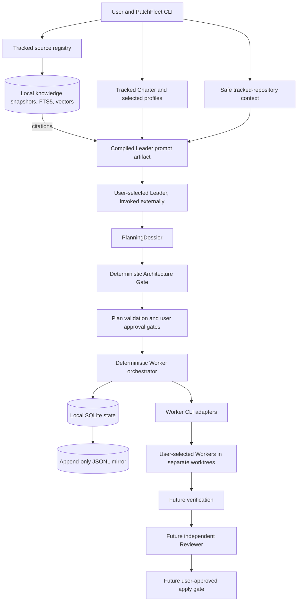

# PatchFleet

PatchFleet is a local-first, human-approved CLI control plane for coordinating existing coding-agent CLIs. You choose the Leader, Workers, and Reviewer, including each provider and model. PatchFleet is intended to turn their work into a visible plan, bounded tasks, independent review, and an explicit decision before changes reach your main branch. It does not replace Codex CLI, Claude Code, or other coding agents.

Launching several agents is easy; keeping their assignments, dependencies, changes, and approvals coherent is harder. PatchFleet addresses that coordination problem while keeping the repository and decisions on your machine.

Phase 3A adds a user-owned Engineering Charter, versioned planning profiles, safe tracked-repository context, a compiled Leader prompt, and an evidence-backed Architecture Gate. It does **not** invoke a Leader model or approve a plan. Phase 3B adds an optional, local, citation-backed engineering knowledge layer that can feed the Leader prompt.

Phase 4A turns the bare `patchfleet` command into a friendly, prompt-based terminal shell with guided first-run setup, local provider discovery, and personal defaults.

Phase 4B makes the Leader real for Codex CLI. From inside a target Git repository, free text starts a bounded, read-only Leader planning conversation: the selected Leader either asks focused questions or returns a structured plan draft embedded as a normal PatchFleet `Plan`. The draft is validated against the exact user-selected Leader and Workers. It is a draft only — no Worker, run, approval, worktree, execution event, or Git change is created.

Phase 4C turns PatchFleet into a full-screen terminal application: models are chosen from the user's live provider catalogs (Codex via its local `app-server`, OpenCode via `models --verbose`, Claude reported honestly as catalog-unavailable), an approved draft is handed into the durable Phase 2 run, and a live dashboard shows the Leader plus every active Worker with bounded streamed output. Approval and start remain explicit and separate.

Nothing in Phase 3A, 3B, 4A, 4B, or 4C approves a plan or starts a Worker implicitly. Phase 2's approved Worker path remains the execution foundation; verification, review, and application are still unimplemented, and the fleet stops at `VERIFYING`.

## Core principles

- **The user chooses.** PatchFleet never silently selects or substitutes a provider, model, or role.
- **Plan before execution.** The Leader discusses the request with the user and proposes a structured engineering plan. Validation and user approval precede Worker execution.
- **Bounded work.** Workers receive explicit tasks, path limits, acceptance criteria, test commands, and budgets. Each Worker runs in a dedicated Git worktree.
- **Independent review.** A Reviewer runs separately from the implementer and evaluates the result against the approved plan.
- **Human-controlled integration.** Applying code to the main branch requires a distinct, explicit user approval.
- **Local by default.** State and event logs live locally. No PatchFleet account, cloud service, GitHub Issues, or web dashboard is required.

## Intended architecture



Contracts, validation, state machine, persistence, Codex CLI/Claude Code Worker adapters, worktrees, bounded execution, the Phase 3A planning dossier/gate, the Phase 3B local knowledge store, the Phase 4A interactive shell plus non-secret personal preferences, and the Phase 4B bounded Codex CLI Leader conversation exist. Codex CLI supports Worker execution and read-only Leader planning; Claude Code supports Worker execution only; OpenCode is detected for future support only, with no execution or Leader adapter. Verification, review, and application remain planned.

## Planned workflow

1. The user states a request, owns the Engineering Charter and profile choices, explicitly selects the Leader provider/model, and may vetted-ingest citation-backed reference material.
2. For the advanced dossier path, a compiled prompt plus repository evidence and optional knowledge citations feed a manually driven PlanningDossier and task graph. Ordinary Leader conversation is implemented separately in Phase 4B.
3. The user resolves open questions and explicitly selects every Worker and Reviewer provider/model. PatchFleet validates the dossier and embedded Plan.
4. The user separately approves the exact execution Plan before any Worker starts.
5. Workers execute bounded tasks in separate Git worktrees.
6. In a later phase, PatchFleet runs the specified verification commands and records their results.
7. A separate Reviewer run checks the implementation and verification evidence.
8. The user explicitly approves applying the reviewed result to the main branch.

Failed validation, verification, or review pauses the flow for correction or replanning; it does not waive an approval gate.

## Roadmap to v0.1

| Phase | Planned outcome |
| --- | --- |
| 0 — Foundation | Product and architecture documents; installable `patchfleet --help`. |
| 1 — Contracts and state | Implemented: Pydantic plan/task schemas, validation, explicit transitions, local SQLite state, and JSONL events. |
| 2 — Local execution | Implemented: user-configured Codex CLI and Claude Code Worker adapters, bounded subprocess runs, one worktree per task, and durable attempts. Interrupted attempts require explicit later action; they are not resumed automatically. |
| 3A — Leader Engineering Intelligence | Implemented: tracked Engineering Charter contract, explicit versioned profiles, safe repository context, prompt compilation, separate PlanningDossier, and deterministic Architecture Gate. No model invocation. |
| 3B — Local engineering RAG | Implemented: tracked source registry, confirmed ingestion of local Markdown, pinned-Git Markdown, or one explicit HTML page, immutable local snapshots, heading-aware chunks, SQLite FTS5 plus optional local embeddings, hybrid citation retrieval, and optional Leader prompt citations. No crawling or model downloads. |
| 4A — Interactive Fleet Setup | Implemented: default interactive shell, guided first-run setup, local provider discovery, versioned non-secret personal preferences, `settings show`, and deterministic project-override precedence. No Leader or Worker model is invoked. |
| 4B — Live Leader conversation | Implemented for Codex CLI: a bounded read-only Leader turn per explicit user request, a versioned strict response contract, question/answer conversation, and a validated structured plan draft. Claude Code remains Worker-only; OpenCode remains detection-only. A draft is not execution authorization. |
| 4C — Live catalogs, TUI, and fleet handoff | Implemented: provider-owned live model catalogs, a Textual full-screen Fleet TUI, and an explicit approve → exact durable run → start handoff with a live Leader/Worker dashboard. Phase 2 still ends at `VERIFYING`. |
| Later — Review and integration | Verification, a separate Reviewer run, reviewed-result approval, and controlled apply to the main branch. |
| v0.1 | A documented end-to-end local workflow with tests for the safety gates and failure paths. |

Provider support is stated precisely: Codex CLI supports Worker execution, read-only Leader planning, and live model cataloging through its local `codex app-server`; Claude Code supports Worker execution only and honestly reports that its CLI exposes no account-specific catalog command; OpenCode can provide a live catalog from `opencode models --verbose` but remains execution-disabled and Leader-disabled because no bounded adapter is implemented and tested.

## Non-goals for v0.1

- Choosing or switching providers or models on the user's behalf.
- Replacing the underlying coding-agent CLIs or promising a security sandbox for them.
- A hosted account, remote control plane, GitHub Issues dependency, or web dashboard.
- A full-screen terminal UI, autonomous merging, or unattended application to the main branch. Phase 4A ships a lightweight prompt-based shell, not a TUI.
- Agent-framework orchestration, distributed workers, or container infrastructure.
- Web crawling, recursive domain scraping, PDF or book ingestion, a general web search engine, or a hosted vector database.
- Automatic model downloads, automatic network access, embeddings without an explicit local model, or automatic provider/model selection.

## Why PatchFleet?

Multiple terminals can run multiple agents, but they do not establish a shared task contract, dependency order, review evidence, or an auditable approval boundary. PatchFleet aims to supply those coordination rules around tools the user already chose. Its value is the controlled workflow, not another model interface.

## Quick start

Python 3.11 or newer is required. No YAML file, Charter, dossier, or knowledge registry is needed to begin.

```bash
python -m pip install -e .
patchfleet
```

On a first run in an interactive terminal, PatchFleet discovers installed provider CLIs locally and guides you through choosing a default Leader provider/model, one or more default Worker provider/model assignments, and a maximum parallel Worker count. It stores only those non-secret choices in your personal preferences, then opens a prompt-based shell:

```text
$ patchfleet

PatchFleet
Leader: codex-cli / <your-leader-model>
Workers: codex-cli / <your-worker-model>
Maximum parallel Workers: 2
Providers discovered locally:
  Codex CLI (codex-cli): installed (version ...); worker execution: yes; leader planning: yes
  Claude Code (claude-code): not found
  OpenCode (opencode): installed (version ...); detection only (future support)

Type /help for commands, or describe what you want to build.
> Build a small REST API for tasks.

Planning with codex-cli / <your-leader-model>…
Leader:
  Before I plan this, should tasks be private per user or shared?
  - Should tasks be private per user or shared?
> Private per user.

Planning with codex-cli / <your-leader-model>…
Leader proposal:
  ...
  - T1: API data model and endpoints
      codex-cli / <your-worker-model>
Planning draft is ready.
No Worker was started and no execution approval exists.
Interactive execution handoff arrives in the next phase.
```

The shell supports `/new [request]`, `/plan`, `/cancel`, `/settings`, `/doctor`, `/help`, and `/quit`. Free text starts planning, or answers the Leader's latest question. The shell invokes the Leader only inside a target Git repository and only as a bounded local subprocess; it never starts a Worker, creates a run, provisions a worktree, records an approval, executes verification, or changes Git. PatchFleet never picks or substitutes a provider, model, or executable: if the selected Leader is unavailable or not Leader-capable, planning explains the problem and points to `/settings`. In a non-interactive terminal, `patchfleet` prints a short explanation plus help and exits with a non-zero usage status instead of blocking.

The existing read-only plan commands remain available:

```bash
patchfleet --help
patchfleet plan validate examples/plan.yaml
patchfleet plan fingerprint examples/plan.yaml
```

The plan commands are read-only: they neither approve a plan nor start a Worker. The fingerprint command prints the SHA-256 identity of a valid plan. The example uses illustrative model IDs; replace them with your own selections. The current schema is explained in the [task contract](docs/task-contract.md).

## Personal preferences and settings

Personal preferences are versioned, validated, and non-secret. They live in a platform-appropriate user configuration directory (via `platformdirs`), for example `~/.config/patchfleet/preferences.yaml` on Linux. PatchFleet writes them atomically with restrictive permissions where supported. They are separate from target-repository `.patchfleet/` state, the tracked `patchfleet.project.yaml` charter, the tracked `patchfleet.knowledge.yaml` registry, and execution approval records. They store only the schema version, optional provider executable overrides, explicit default Leader and Worker provider/model selections, the maximum parallel Worker count, and small UI preferences. Credentials, tokens, environment variables, agent prompts, raw outputs, approvals, and repository task state are never stored there.

```bash
patchfleet settings          # guided editor; writes only after explicit confirmation
patchfleet settings show     # read-only summary; safe in non-interactive environments
```

`settings show` labels every value with its source so a personal default is never confused with a project override. A malformed preferences file is reported with an offer to reconfigure and is never overwritten without confirmation. Cancelling setup, or declining to save, writes nothing.

Effective defaults resolve deterministically, highest priority first:

1. explicit command options;
2. a valid target-repository `.patchfleet/config.yaml` override;
3. valid personal preferences;
4. safe built-in defaults.

The project `.patchfleet/config.yaml` remains the advanced per-project execution override and is unchanged from Phase 2. It does not define Leader/Worker selections, which come only from explicit user choices.

## Provider discovery boundaries

Discovery is local and read-only. PatchFleet checks each provider's configured executable (a built-in name, a project override, or a personal override) and runs only bounded `--version`/`--help` capability checks. It never contacts a provider network service, never invokes an agent task, never downloads anything, and never selects a provider or model. Discovery distinguishes Worker-execution capability, Leader-planning capability, and detection-only support. Codex CLI has both a Worker execution adapter and a read-only Leader planning adapter; Claude Code has a Worker execution adapter only; OpenCode is detection-only. A provider whose help output does not expose the required explicit model/flags (including Codex's `--sandbox read-only`, `--output-schema`, and `--output-last-message`) is reported as installed but not capable and cannot be selected for that role.

If a provider CLI is not on `PATH`, first-run setup and `patchfleet settings` let you enter an executable path for a known provider. The path is validated with the same local resolver and discovery, rediscovered immediately, and saved only as an explicit personal override; nothing is substituted. A user with a valid absolute path to Codex CLI can complete setup without creating or editing any PatchFleet YAML file.

## Live Leader planning (Phase 4B)

Planning invokes exactly one explicitly selected Leader CLI, once per explicit user turn, only inside a target Git repository.

- Codex CLI is the only implemented Leader provider. It runs as `codex exec --model <selected> --sandbox read-only --ephemeral --output-schema <file> --output-last-message <file> -` from the repository root with the prompt on stdin. PatchFleet uses argument arrays (never a shell string), the strongest documented read-only sandbox, wall-clock timeout, bounded stdout/stderr, bounded response size, and Ctrl-C cancellation.
- The Leader returns exactly one strict JSON outcome: `questions` or `plan_draft` (schema version `0.1`). A `plan_draft` embeds an ordinary PatchFleet `Plan` plus assumptions, risks, per-task rationale, and a plain-language Worker-usage explanation.
- A draft must pass existing `Plan` validation and use only the user's explicit Leader and Worker provider/model selections. A malformed, oversized, invalid, or substituted draft is rejected with a clear error; PatchFleet does not auto-correct by making another call.
- One paid model call happens only for one explicit conversation turn. There is no retry, fallback, or extra call.
- The prompt contains the current request and answer history, repository root and pinned HEAD, exact Leader and Worker selections, maximum parallelism, a bounded structural repository summary from the Phase 3A context machinery, and the exact response JSON Schema. Charter and RAG context are not part of the ordinary flow.
- Conversation history, prompts, and raw Leader output are session-local and in memory only: never in preferences, JSONL execution events, the execution database, or the repository. A repository HEAD change between context capture and the response is rejected.
- A validated plan draft is **not** execution authorization. Planning itself never calls `run create`, `run approve`, `run start`, or a Worker adapter; Phase 4C adds a separate, explicit Approve then Start handoff to Phase 2.

Planning requires a target Git repository. Outside one, `/settings` and `/doctor` still work, but planning explains that it needs a repository and does not invoke the Leader.

## Interactive Fleet experience (Phase 4C)

Run `patchfleet` in an interactive terminal inside a Git repository to launch the full-screen Fleet TUI. The classic commands (`doctor`, `plan`, `run create`, `run approve`, `run start`, `run status`, `charter`, `context`, `leader`, `architecture`, `knowledge`, `settings show`) remain unchanged. If Textual or a real terminal is unavailable, PatchFleet falls back to the Phase 4B prompt shell.

### Live model catalogs

A model is selectable only from a fresh, successful provider catalog; there is no curated or fallback list anywhere, and no paid call is made merely to validate a model.

- **Codex CLI** — PatchFleet starts the local, already-authenticated `codex app-server --stdio`, performs the documented JSON-RPC `initialize` / `initialized` handshake, calls `model/list`, follows `nextCursor` to completion, then shuts the subprocess down. Model id, display name, description, visibility, default reasoning effort, and supported reasoning efforts come from the account-specific response.
- **OpenCode** — PatchFleet runs `opencode models --verbose` and parses the stable `provider/model` + JSON blocks, reflecting the user's currently connected OpenCode providers. OpenCode remains execution-disabled and Leader-disabled.
- **Claude Code** — Claude's CLI documents aliases and explicit ids but no account-specific catalog command. PatchFleet reports catalog-unavailable with a clear explanation; it never shows a static Claude list and never asks the user to type a model id.

Catalogs are cached in memory for the active TUI session only, and "Refresh catalog" is an explicit action. A saved selection that disappears from a fresh catalog is shown as unavailable and blocks new execution until reselected. Only the selected id and its catalog source/timestamp are stored in personal preferences; raw catalog data and credentials are never stored.

### Approval and execution boundary

The Fleet TUI preserves the exact Phase 1/2 guards: the Leader draft must pass `Plan` validation; the user explicitly chooses Approve, which creates the durable run and records the existing `PLAN_EXECUTION` approval for the exact plan fingerprint and revision; a separate "Start fleet" confirmation is then required before worktrees are provisioned and Workers start. A plan merely existing never starts anything.

### Live fleet dashboard

Once started, the Leader panel occupies the upper ~35% and Worker panels fill the lower region: one full-width panel for one Worker, two columns for two, a 2×2 grid for three or four, and a paged 2×2 grid for more than four. Narrow or short terminals switch to a single active Worker panel with `n`/`p` paging. Each panel shows task id/title, provider/model, state, attempt, elapsed time, worktree, dependency/block reason, and a bounded output tail.

Raw Worker output exists only in the in-memory UI buffer. It is never written to events, SQLite, JSONL mirrors, preferences, or telemetry. Terminal control sequences are stripped, output is bounded and labeled when truncated, and completed/failed panels remain visible until the user exits or starts a new fleet. The Leader panel is a truthful coordination/status view driven by scheduler and process events; it does not claim the model is reviewing Worker output.

Phase 2 ends at `VERIFYING`. This phase adds no automatic verification, review, Git application, commit, or push. `q` never silently abandons a running fleet: the TUI asks whether to cancel (and quit) or keep the fleet running in this session; there is no background daemon.

## Phase 3A planning workflow (advanced, opt-in)

The Engineering Charter is an advanced, opt-in capability; the ordinary interactive flow above never requires it. The charter is a user-owned, version-controlled `patchfleet.project.yaml` at the target repository root. It is separate from ignored `.patchfleet/` state. PatchFleet never creates it implicitly. To start from a commented template, explicitly run `charter init`, edit it, and track it with Git yourself:

```bash
patchfleet charter init --repo /path/to/target-repository
# Edit patchfleet.project.yaml, then add/commit it yourself.
patchfleet context inspect --repo /path/to/target-repository --path src/relevant_module.py
patchfleet context show <context-id> --repo /path/to/target-repository
patchfleet leader prompt request.md --repo /path/to/target-repository \
  --provider <user-selected-leader-provider> --model <user-selected-leader-model>
# Give the saved prompt to your selected Leader manually; complete a dossier YAML.
patchfleet architecture validate dossier.yaml --repo /path/to/target-repository
```

`context inspect` reads only bounded tracked files, filters secret-like paths, and stores structural summaries rather than raw source in ignored local state. `leader prompt` compiles a prompt with the exact `PlanningDossier` JSON Schema and shows its safe local path; it never invokes a CLI or records the prompt in JSONL events. The Architecture Gate checks evidence references, charter/profile requirements, risk treatment, and the embedded execution Plan. A ready dossier is **not** an execution approval: the proposed Plan still needs the existing `plan validate`, `run create`, and explicit `run approve` flow. If Worker/Reviewer selections are missing, the Leader must ask the user rather than invent them. See the [planning contract](docs/task-contract.md#planning-dossier-phase-3a).

## Phase 3B knowledge workflow (advanced, opt-in)

Knowledge is an advanced, opt-in capability and is never required by the ordinary interactive flow. It is local and citation-backed. The tracked `patchfleet.knowledge.yaml` registry is never created for you: start from [examples/patchfleet.knowledge.example.yaml](examples/patchfleet.knowledge.example.yaml), declare a real license, trust level, canonical URL or pinned revision, and explicit domain/path boundaries, then set `enabled: true` only for sources you have vetted.

```bash
patchfleet knowledge validate patchfleet.knowledge.yaml --repo /path/to/target-repository
patchfleet knowledge ingest <source-id> --repo /path/to/target-repository --confirm
patchfleet knowledge status --repo /path/to/target-repository
# Optional semantic search; requires an already-present local model directory.
python -m pip install -e ".[knowledge]"
patchfleet knowledge index --repo /path/to/target-repository \
  --embedding-model /local/path/to/model --embedding-revision <exact-revision>
patchfleet knowledge search "trust boundary validation" --repo /path/to/target-repository \
  --tags security --profile security-sensitive
# Optionally attach cited chunks to the compiled Leader prompt:
patchfleet leader prompt request.md --repo /path/to/target-repository \
  --provider <user-selected-leader-provider> --model <user-selected-leader-model> \
  --knowledge-query "trust boundary validation"
```

Ingestion covers only local tracked Markdown, explicit Markdown files from a pinned Git revision, or one explicit HTML page per source. Remote HTML is HTTPS-only (loopback HTTP is allowed for testing), redirects must remain inside the source's allowlisted domains, and a size limit and timeout apply. Raw snapshots and normalized Markdown are stored immutably under ignored `.patchfleet/knowledge/`, keyed to source version and content hash; unchanged content is never re-chunked or re-embedded. `knowledge index` uses only an existing local model path and never downloads one; without one, `knowledge status` reports "text indexed but semantic search unavailable" and `knowledge search` falls back to FTS5 lexical search. `knowledge search` prints source title, locator, heading path, trust, license, and the `knowledge:chunk:...` citation ID. `leader prompt` can optionally include retrieved chunks; they are always framed as reference data, never instructions. Knowledge never writes JSONL execution events or the execution SQLite store. See the [knowledge contract](docs/task-contract.md#local-knowledge-phase-3b).

For local Worker execution, place this explicit configuration at `<target-repository>/.patchfleet/config.yaml` (change executable paths and enable only providers you intend to use):

```yaml
schema_version: "0.1"
execution:
  max_parallel_workers: 2
providers:
  codex-cli:
    enabled: true
    executable: "codex"
  claude-code:
    enabled: false
    executable: "claude"
```

Then run:

```bash
patchfleet doctor --repo /path/to/target-repository
patchfleet doctor --repo /path/to/target-repository --plan /path/to/plan.yaml
patchfleet run create /path/to/plan.yaml --repo /path/to/target-repository
patchfleet run status <run-id> --repo /path/to/target-repository
patchfleet run approve <run-id> --actor "Your Name" --repo /path/to/target-repository
patchfleet run start <run-id> --repo /path/to/target-repository
patchfleet run status <run-id> --repo /path/to/target-repository
```

`doctor` and `run status` are read-only. `doctor --plan` reports each selected Worker provider/model and whether its configured CLI exposes explicit model selection; it cannot confirm a model's remote availability offline. `run create` validates and stores the exact plan and target commit but does not launch a Worker. `run approve` records a `PLAN_EXECUTION` decision for that run's exact revision/fingerprint. `run start` requires this approval, an unchanged target HEAD, and every selected Worker provider configured and capable of expressing its selected model. It then runs dependency-ready tasks in isolated worktrees and stops at `VERIFYING` when all succeed; **no verification command runs in Phase 2**. Failures and out-of-scope changes remain visible in `run status`. There is no automatic retry or cleanup; inspect worktrees manually.

Only Codex CLI and Claude Code Worker adapters are available. OpenCode can provide a live model catalog but has no execution or Leader adapter. Provider CLIs' own credentials and network access may be needed when actually invoked; PatchFleet does not contact a provider network service during discovery, `doctor`, `settings show`, or catalog fetching (cataloging uses only the provider's own local CLI or app-server). Worktrees separate source changes but are **not security sandboxes**: a local CLI may access anything the invoking user can. Use only trusted CLIs and a separate OS-level sandbox if that boundary is needed.

For development, create a clean virtual environment so the declared dependencies (including `platformdirs`) are installed, then run the checks with that interpreter:

```bash
python3 -m venv .venv
.venv/bin/python -m pip install -e ".[dev]"
.venv/bin/python -m pytest
.venv/bin/python -m ruff format --check .
.venv/bin/python -m ruff check .
```

The `knowledge` extra adds HTML extraction and local Sentence Transformers support; the base install and all tests work without it.

See [product requirements](docs/product-requirements.md), [architecture](docs/architecture.md), and the [proposed task contract](docs/task-contract.md). Contributions are welcome; start with [CONTRIBUTING.md](CONTRIBUTING.md).
