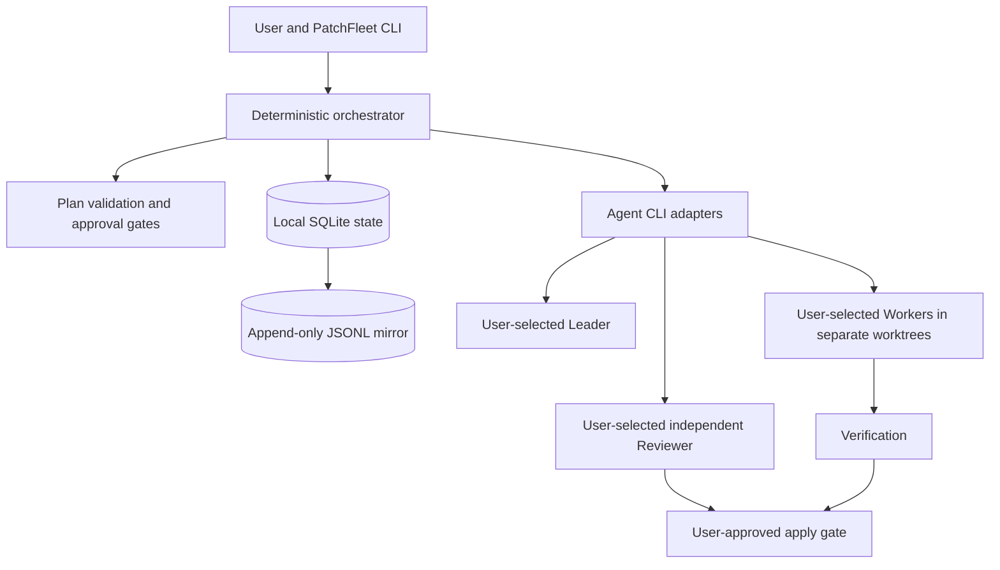

# PatchFleet

PatchFleet is a local-first, human-approved CLI control plane for coordinating existing coding-agent CLIs. You choose the Leader, Workers, and Reviewer, including each provider and model. PatchFleet is intended to turn their work into a visible plan, bounded tasks, independent review, and an explicit decision before changes reach your main branch. It does not replace Codex CLI, Claude Code, or other coding agents.

Launching several agents is easy; keeping their assignments, dependencies, changes, and approvals coherent is harder. PatchFleet addresses that coordination problem while keeping the repository and decisions on your machine.

Phase 2 adds explicit local provider configuration, capability checks, approved Worker dispatch, bounded subprocess supervision, Git worktree isolation, dependency scheduling, and persisted task attempts. The CLI still does **not** plan, review, run verification commands, or apply changes to the main branch.

## Core principles

- **The user chooses.** PatchFleet never silently selects or substitutes a provider, model, or role.
- **Plan before execution.** The Leader discusses the request with the user and proposes a structured engineering plan. Validation and user approval precede Worker execution.
- **Bounded work.** Workers receive explicit tasks, path limits, acceptance criteria, test commands, and budgets. Each Worker runs in a dedicated Git worktree.
- **Independent review.** A Reviewer runs separately from the implementer and evaluates the result against the approved plan.
- **Human-controlled integration.** Applying code to the main branch requires a distinct, explicit user approval.
- **Local by default.** State and event logs live locally. No PatchFleet account, cloud service, GitHub Issues, or web dashboard is required.

## Intended architecture



Contracts, validation, state machine, persistence, Codex CLI/Claude Code Worker adapters, worktrees, and bounded execution exist. Leader planning, verification, review, and application remain planned.

## Planned workflow

1. The user states a request and explicitly selects the Leader, Worker(s), and Reviewer with their models.
2. The Leader discusses the request with the user and produces a structured plan.
3. PatchFleet validates the plan's shape, dependencies, assignments, limits, and approval requirements.
4. The user approves the plan before any Worker starts.
5. Workers execute bounded tasks in separate Git worktrees.
6. PatchFleet runs the specified verification commands and records their results.
7. A separate Reviewer run checks the implementation and verification evidence.
8. The user explicitly approves applying the reviewed result to the main branch.

Failed validation, verification, or review pauses the flow for correction or replanning; it does not waive an approval gate.

## Roadmap to v0.1

| Phase | Planned outcome |
| --- | --- |
| 0 — Foundation | Product and architecture documents; installable `patchfleet --help`. |
| 1 — Contracts and state | Implemented: Pydantic plan/task schemas, validation, explicit transitions, local SQLite state, and JSONL events. |
| 2 — Local execution | Implemented: user-configured Codex CLI and Claude Code Worker adapters, bounded subprocess runs, one worktree per task, and durable attempts. Interrupted attempts require explicit later action; they are not resumed automatically. |
| 3 — Review and integration | Verification, a separate Reviewer run, approval prompts, and controlled apply to the main branch. |
| v0.1 | A documented end-to-end local workflow with tests for the safety gates and failure paths. |

OpenCode support is planned after the initial adapters.

## Non-goals for v0.1

- Choosing or switching providers or models on the user's behalf.
- Replacing the underlying coding-agent CLIs or promising a security sandbox for them.
- A hosted account, remote control plane, GitHub Issues dependency, or web dashboard.
- A terminal UI, autonomous merging, or unattended application to the main branch.
- Agent-framework orchestration, distributed workers, or container infrastructure.

## Why PatchFleet?

Multiple terminals can run multiple agents, but they do not establish a shared task contract, dependency order, review evidence, or an auditable approval boundary. PatchFleet aims to supply those coordination rules around tools the user already chose. Its value is the controlled workflow, not another model interface.

## Local CLI quick start

Python 3.11 or newer is required.

```bash
python -m pip install -e .
patchfleet --help
patchfleet plan validate examples/plan.yaml
patchfleet plan fingerprint examples/plan.yaml
```

The plan commands are read-only: they neither approve a plan nor start a Worker. The fingerprint command prints the SHA-256 identity of a valid plan. The example uses illustrative model IDs; replace them with your own selections. The current schema is explained in the [task contract](docs/task-contract.md).

For local Worker execution, place this explicit configuration at `<target-repository>/.patchfleet/config.yaml` (change executable paths and enable only providers you intend to use):

```yaml
schema_version: "0.1"
execution:
  max_parallel_workers: 2
providers:
  codex-cli:
    enabled: true
    executable: "codex"
  claude-code:
    enabled: false
    executable: "claude"
```

Then run:

```bash
patchfleet doctor --repo /path/to/target-repository
patchfleet doctor --repo /path/to/target-repository --plan /path/to/plan.yaml
patchfleet run create /path/to/plan.yaml --repo /path/to/target-repository
patchfleet run status <run-id> --repo /path/to/target-repository
patchfleet run approve <run-id> --actor "Your Name" --repo /path/to/target-repository
patchfleet run start <run-id> --repo /path/to/target-repository
patchfleet run status <run-id> --repo /path/to/target-repository
```

`doctor` and `run status` are read-only. `doctor --plan` reports each selected Worker provider/model and whether its configured CLI exposes explicit model selection; it cannot confirm a model's remote availability offline. `run create` validates and stores the exact plan and target commit but does not launch a Worker. `run approve` records a `PLAN_EXECUTION` decision for that run's exact revision/fingerprint. `run start` requires this approval, an unchanged target HEAD, and every selected Worker provider configured and capable of expressing its selected model. It then runs dependency-ready tasks in isolated worktrees and stops at `VERIFYING` when all succeed; **no verification command runs in Phase 2**. Failures and out-of-scope changes remain visible in `run status`. There is no automatic retry or cleanup; inspect worktrees manually.

Only Codex CLI and Claude Code Worker adapters are available. Their own credentials and network access may be needed when actually invoked; PatchFleet does not contact providers in `doctor`. Worktrees separate source changes but are **not security sandboxes**: a local CLI may access anything the invoking user can. Use only trusted CLIs and a separate OS-level sandbox if that boundary is needed.

For development, install `python -m pip install -e ".[dev]"` and run `python -m pytest`, `python -m ruff format --check .`, and `python -m ruff check .`.

See [product requirements](docs/product-requirements.md), [architecture](docs/architecture.md), and the [proposed task contract](docs/task-contract.md). Contributions are welcome; start with [CONTRIBUTING.md](CONTRIBUTING.md).
