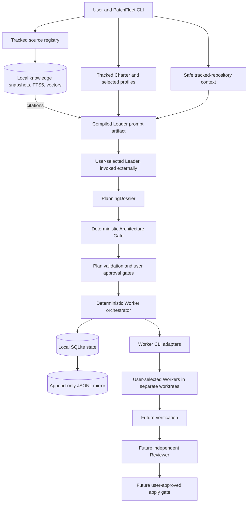

# PatchFleet

PatchFleet is a local-first, human-approved CLI control plane for coordinating existing coding-agent CLIs. You choose the Leader, Workers, and Reviewer, including each provider and model. PatchFleet is intended to turn their work into a visible plan, bounded tasks, independent review, and an explicit decision before changes reach your main branch. It does not replace Codex CLI, Claude Code, or other coding agents.

Launching several agents is easy; keeping their assignments, dependencies, changes, and approvals coherent is harder. PatchFleet addresses that coordination problem while keeping the repository and decisions on your machine.

Phase 3A adds a user-owned Engineering Charter, versioned planning profiles, safe tracked-repository context, a compiled Leader prompt, and an evidence-backed Architecture Gate. It does **not** invoke a Leader model or approve a plan. Phase 3B adds an optional, local, citation-backed engineering knowledge layer that can feed the Leader prompt.

Neither phase invokes a model or approves a plan. Phase 2's approved Worker path remains separate and unchanged; verification, review, and application are still unimplemented.

## Core principles

- **The user chooses.** PatchFleet never silently selects or substitutes a provider, model, or role.
- **Plan before execution.** The Leader discusses the request with the user and proposes a structured engineering plan. Validation and user approval precede Worker execution.
- **Bounded work.** Workers receive explicit tasks, path limits, acceptance criteria, test commands, and budgets. Each Worker runs in a dedicated Git worktree.
- **Independent review.** A Reviewer runs separately from the implementer and evaluates the result against the approved plan.
- **Human-controlled integration.** Applying code to the main branch requires a distinct, explicit user approval.
- **Local by default.** State and event logs live locally. No PatchFleet account, cloud service, GitHub Issues, or web dashboard is required.

## Intended architecture



Contracts, validation, state machine, persistence, Codex CLI/Claude Code Worker adapters, worktrees, bounded execution, the Phase 3A planning dossier/gate, and the Phase 3B local knowledge store exist. Direct Leader invocation, verification, review, and application remain planned.

## Planned workflow

1. The user states a request, owns the Engineering Charter and profile choices, explicitly selects the Leader provider/model, and may vetted-ingest citation-backed reference material.
2. The selected Leader uses a manually supplied prompt plus repository evidence and optional knowledge citations to propose a PlanningDossier and task graph; direct Leader invocation is not yet implemented.
3. The user resolves open questions and explicitly selects every Worker and Reviewer provider/model. PatchFleet validates the dossier and embedded Plan.
4. The user separately approves the exact execution Plan before any Worker starts.
5. Workers execute bounded tasks in separate Git worktrees.
6. In a later phase, PatchFleet runs the specified verification commands and records their results.
7. A separate Reviewer run checks the implementation and verification evidence.
8. The user explicitly approves applying the reviewed result to the main branch.

Failed validation, verification, or review pauses the flow for correction or replanning; it does not waive an approval gate.

## Roadmap to v0.1

| Phase | Planned outcome |
| --- | --- |
| 0 — Foundation | Product and architecture documents; installable `patchfleet --help`. |
| 1 — Contracts and state | Implemented: Pydantic plan/task schemas, validation, explicit transitions, local SQLite state, and JSONL events. |
| 2 — Local execution | Implemented: user-configured Codex CLI and Claude Code Worker adapters, bounded subprocess runs, one worktree per task, and durable attempts. Interrupted attempts require explicit later action; they are not resumed automatically. |
| 3A — Leader Engineering Intelligence | Implemented: tracked Engineering Charter contract, explicit versioned profiles, safe repository context, prompt compilation, separate PlanningDossier, and deterministic Architecture Gate. No model invocation. |
| 3B — Local engineering RAG | Implemented: tracked source registry, confirmed ingestion of local Markdown, pinned-Git Markdown, or one explicit HTML page, immutable local snapshots, heading-aware chunks, SQLite FTS5 plus optional local embeddings, hybrid citation retrieval, and optional Leader prompt citations. No crawling or model downloads. |
| Later — Review and integration | Verification, a separate Reviewer run, reviewed-result approval, and controlled apply to the main branch. |
| v0.1 | A documented end-to-end local workflow with tests for the safety gates and failure paths. |

OpenCode support is planned after the initial adapters.

## Non-goals for v0.1

- Choosing or switching providers or models on the user's behalf.
- Replacing the underlying coding-agent CLIs or promising a security sandbox for them.
- A hosted account, remote control plane, GitHub Issues dependency, or web dashboard.
- A terminal UI, autonomous merging, or unattended application to the main branch.
- Agent-framework orchestration, distributed workers, or container infrastructure.
- Web crawling, recursive domain scraping, PDF or book ingestion, a general web search engine, or a hosted vector database.
- Automatic model downloads, automatic network access, embeddings without an explicit local model, or automatic provider/model selection.

## Why PatchFleet?

Multiple terminals can run multiple agents, but they do not establish a shared task contract, dependency order, review evidence, or an auditable approval boundary. PatchFleet aims to supply those coordination rules around tools the user already chose. Its value is the controlled workflow, not another model interface.

## Local CLI quick start

Python 3.11 or newer is required.

```bash
python -m pip install -e .
patchfleet --help
patchfleet plan validate examples/plan.yaml
patchfleet plan fingerprint examples/plan.yaml
```

The plan commands are read-only: they neither approve a plan nor start a Worker. The fingerprint command prints the SHA-256 identity of a valid plan. The example uses illustrative model IDs; replace them with your own selections. The current schema is explained in the [task contract](docs/task-contract.md).

## Phase 3A planning workflow

The Engineering Charter is a user-owned, version-controlled `patchfleet.project.yaml` at the target repository root. It is separate from ignored `.patchfleet/` state. PatchFleet never creates it implicitly. To start from a commented template, explicitly run `charter init`, edit it, and track it with Git yourself:

```bash
patchfleet charter init --repo /path/to/target-repository
# Edit patchfleet.project.yaml, then add/commit it yourself.
patchfleet context inspect --repo /path/to/target-repository --path src/relevant_module.py
patchfleet context show <context-id> --repo /path/to/target-repository
patchfleet leader prompt request.md --repo /path/to/target-repository \
  --provider <user-selected-leader-provider> --model <user-selected-leader-model>
# Give the saved prompt to your selected Leader manually; complete a dossier YAML.
patchfleet architecture validate dossier.yaml --repo /path/to/target-repository
```

`context inspect` reads only bounded tracked files, filters secret-like paths, and stores structural summaries rather than raw source in ignored local state. `leader prompt` compiles a prompt with the exact `PlanningDossier` JSON Schema and shows its safe local path; it never invokes a CLI or records the prompt in JSONL events. The Architecture Gate checks evidence references, charter/profile requirements, risk treatment, and the embedded execution Plan. A ready dossier is **not** an execution approval: the proposed Plan still needs the existing `plan validate`, `run create`, and explicit `run approve` flow. If Worker/Reviewer selections are missing, the Leader must ask the user rather than invent them. See the [planning contract](docs/task-contract.md#planning-dossier-phase-3a).

## Phase 3B knowledge workflow

Knowledge is opt-in and local. The tracked `patchfleet.knowledge.yaml` registry is never created for you: start from [examples/patchfleet.knowledge.example.yaml](examples/patchfleet.knowledge.example.yaml), declare a real license, trust level, canonical URL or pinned revision, and explicit domain/path boundaries, then set `enabled: true` only for sources you have vetted.

```bash
patchfleet knowledge validate patchfleet.knowledge.yaml --repo /path/to/target-repository
patchfleet knowledge ingest <source-id> --repo /path/to/target-repository --confirm
patchfleet knowledge status --repo /path/to/target-repository
# Optional semantic search; requires an already-present local model directory.
python -m pip install -e ".[knowledge]"
patchfleet knowledge index --repo /path/to/target-repository \
  --embedding-model /local/path/to/model --embedding-revision <exact-revision>
patchfleet knowledge search "trust boundary validation" --repo /path/to/target-repository \
  --tags security --profile security-sensitive
# Optionally attach cited chunks to the compiled Leader prompt:
patchfleet leader prompt request.md --repo /path/to/target-repository \
  --provider <user-selected-leader-provider> --model <user-selected-leader-model> \
  --knowledge-query "trust boundary validation"
```

Ingestion covers only local tracked Markdown, explicit Markdown files from a pinned Git revision, or one explicit HTML page per source. Remote HTML is HTTPS-only (loopback HTTP is allowed for testing), redirects must remain inside the source's allowlisted domains, and a size limit and timeout apply. Raw snapshots and normalized Markdown are stored immutably under ignored `.patchfleet/knowledge/`, keyed to source version and content hash; unchanged content is never re-chunked or re-embedded. `knowledge index` uses only an existing local model path and never downloads one; without one, `knowledge status` reports "text indexed but semantic search unavailable" and `knowledge search` falls back to FTS5 lexical search. `knowledge search` prints source title, locator, heading path, trust, license, and the `knowledge:chunk:...` citation ID. `leader prompt` can optionally include retrieved chunks; they are always framed as reference data, never instructions. Knowledge never writes JSONL execution events or the execution SQLite store. See the [knowledge contract](docs/task-contract.md#local-knowledge-phase-3b).

For local Worker execution, place this explicit configuration at `<target-repository>/.patchfleet/config.yaml` (change executable paths and enable only providers you intend to use):

```yaml
schema_version: "0.1"
execution:
  max_parallel_workers: 2
providers:
  codex-cli:
    enabled: true
    executable: "codex"
  claude-code:
    enabled: false
    executable: "claude"
```

Then run:

```bash
patchfleet doctor --repo /path/to/target-repository
patchfleet doctor --repo /path/to/target-repository --plan /path/to/plan.yaml
patchfleet run create /path/to/plan.yaml --repo /path/to/target-repository
patchfleet run status <run-id> --repo /path/to/target-repository
patchfleet run approve <run-id> --actor "Your Name" --repo /path/to/target-repository
patchfleet run start <run-id> --repo /path/to/target-repository
patchfleet run status <run-id> --repo /path/to/target-repository
```

`doctor` and `run status` are read-only. `doctor --plan` reports each selected Worker provider/model and whether its configured CLI exposes explicit model selection; it cannot confirm a model's remote availability offline. `run create` validates and stores the exact plan and target commit but does not launch a Worker. `run approve` records a `PLAN_EXECUTION` decision for that run's exact revision/fingerprint. `run start` requires this approval, an unchanged target HEAD, and every selected Worker provider configured and capable of expressing its selected model. It then runs dependency-ready tasks in isolated worktrees and stops at `VERIFYING` when all succeed; **no verification command runs in Phase 2**. Failures and out-of-scope changes remain visible in `run status`. There is no automatic retry or cleanup; inspect worktrees manually.

Only Codex CLI and Claude Code Worker adapters are available. Their own credentials and network access may be needed when actually invoked; PatchFleet does not contact providers in `doctor`. Worktrees separate source changes but are **not security sandboxes**: a local CLI may access anything the invoking user can. Use only trusted CLIs and a separate OS-level sandbox if that boundary is needed.

For development, install `python -m pip install -e ".[dev]"` and run `python -m pytest`, `python -m ruff format --check .`, and `python -m ruff check .`. The `knowledge` extra adds HTML extraction and local Sentence Transformers support; the base install and all tests work without it.

See [product requirements](docs/product-requirements.md), [architecture](docs/architecture.md), and the [proposed task contract](docs/task-contract.md). Contributions are welcome; start with [CONTRIBUTING.md](CONTRIBUTING.md).
